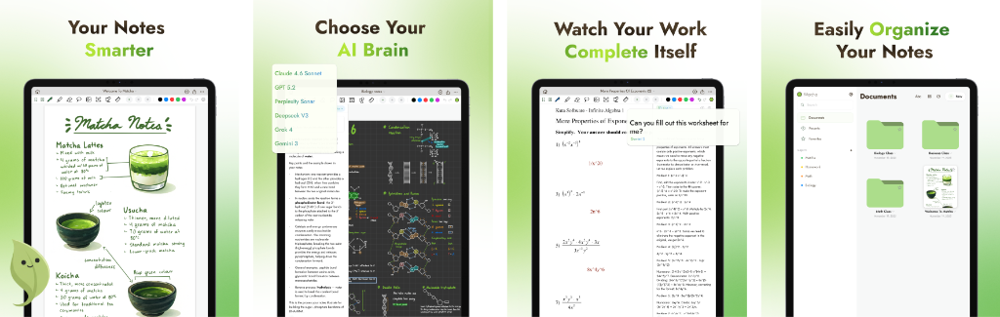

<a name="readme-top"></a>


[![LinkedIn][linkedin-shield]][linkedin-url]
[![MIT License][license-shield]][license-url]


<!-- PROJECT LOGO -->
<br />
<div align="center">
  <a href="https://github.com/forrestcai35/matchanote-app">
    
  </a>

<h3 align="center">Matcha</h3>

  <p align="center">
    Matcha, the beautifully designed AI-powered note-taking assistant.
    <br />
    <br />
    <a href="https://trymatcha.ai"><strong>🌐 Landing Page</strong></a>
    <br />
    <br />
    <a href="https://apps.apple.com/us/app/matcha-take-ai-notes/id6744668137">
      
    </a>
    <br />
    <br />
    <a href="https://github.com/forrestcai35/matchanote-app/issues">Report Bug</a>
    ·
    <a href="https://github.com/forrestcai35/matchanote-app/pulls">Request Feature</a>
  </p>
</div>

<br />

<div align="center">
  
</div>

<br />

<!-- ABOUT THE PROJECT -->
## About The Project
Matcha is an open-source, multi-tab note-taking application for iOS and macOS. It features a powerful handwriting canvas built with `PencilKit`, seamless document management, and an integrated AI assistant that can help analyze your notes and auto-fill worksheets.

### What the Code Does
This repository contains the complete Swift UI codebase for the Matcha app. Core functionalities implemented in this project include:
* **Rich Handwriting Experience:** Native implementation of Apple's `PencilKit` to deliver a zero-latency, highly customized digital canvas tailored for note-taking and drawing.
* **Smart AI Assistant Context Processing:** Takes the canvas data (handwriting and drawings) and intelligently extracts semantic meaning to assist in answering worksheet questions or summarizing notes locally using connected backend services.
* **Document and Storage Management:** A robust document system that locally stores, serializes, and organizes user notebooks. It handles inserting text, images, and seamlessly switching between multiple open note tabs.
* **Cloud & Auth Integrations:** Backend logic built into Swift to handle authentication, cloud sync, and user subscription states.


### Built With

[![Swift][swift-shield]][swift-url]
[![SwiftUI][swiftui-shield]][swiftui-url]


<!-- GETTING STARTED -->
## Getting Started

Follow these steps to get Matcha running on your local machine or device.

### Prerequisites

* Xcode 15.0 or higher
* iOS 16.0+ or macOS 13.0+

### Installation

1. Clone the repo
   ```sh
   git clone https://github.com/forrestcai35/matchanote-app
   ```
2. Open `matchanote-app/matchanote-app.xcodeproj` in Xcode.
3. Wait for Xcode to resolve any dependencies.
4. Select your target device or simulator in Xcode.
5. Build and run using `Cmd + R`.


<!-- USAGE EXAMPLES -->
## Usage


Matcha allows you to:
- Take handwritten notes smoothly using `PencilKit`.
- Seamlessly switch between multiple active notes using the tab interface.
- Manage documents locally, add text boxes, and easily insert images.
- Utilize the **Smart AI Assistant** for intelligent text extraction and insertion to auto-fill worksheets.
- Export single pages or entire notebooks cleanly to PDF.


<!-- CONTRIBUTING -->
## Contributing


If you have a suggestion that would make this better, please fork the repo and create a pull request. You can also simply open an issue with the tag "enhancement". Any contributions you make are **greatly appreciated**. 
Don't forget to give the project a star! Thanks again!

1. Fork the Project
2. Create your Feature Branch (`git checkout -b feature/AmazingFeature`)
3. Commit your Changes (`git commit -m 'Add some AmazingFeature'`)
4. Push to the Branch (`git push origin feature/AmazingFeature`)
5. Open a Pull Request


<!-- LICENSE -->
## License

Distributed under the MIT License. See `LICENSE` for more information.


<!-- CONTACT -->
## Contact

Email: forrestcai35@gmail.com

Project Link: [https://github.com/forrestcai35/matchanote-app](https://github.com/forrestcai35/matchanote-app)

<p align="right">(<a href="#readme-top">back to top</a>)</p>


<!-- MARKDOWN LINKS & IMAGES -->
<!-- https://www.markdownguide.org/basic-syntax/#reference-style-links -->
[contributors-shield]: https://img.shields.io/github/contributors/forrestcai35/matchanote-app.svg?style=for-the-badge
[contributors-url]: https://github.com/forrestcai35/matchanote-app/graphs/contributors
[forks-shield]: https://img.shields.io/github/forks/forrestcai35/matchanote-app.svg?style=for-the-badge
[forks-url]: https://github.com/forrestcai35/matchanote-app/network/members
[stars-shield]: https://img.shields.io/github/stars/forrestcai35/matchanote-app.svg?style=for-the-badge
[stars-url]: https://github.com/forrestcai35/matchanote-app/stargazers
[license-shield]: https://img.shields.io/badge/MIT-red?style=for-the-badge&label=LICENSE
[license-url]: https://github.com/forrestcai35/matchanote-app/blob/master/LICENSE
[linkedin-shield]: https://img.shields.io/badge/-LinkedIn-black.svg?style=for-the-badge&logo=linkedin&colorB=555
[linkedin-url]: https://linkedin.com/in/forrestcai

[swift-shield]: https://img.shields.io/badge/Swift-%23F05138?style=for-the-badge&logo=swift&labelColor=black
[swift-url]: https://developer.apple.com/swift/

[swiftui-shield]: https://img.shields.io/badge/SwiftUI-%23007AFF?style=for-the-badge&logo=swift&labelColor=black
[swiftui-url]: https://developer.apple.com/xcode/swiftui/


